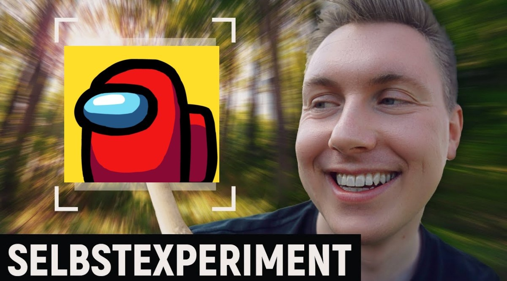

# Wer sind die Rollen?

  Manche Namen sind Böse, aber alles nichts ist hier aus dem Kontext zu reißen. Ich hoffe, ihr versteht den Humor und werdet mich und die Anderen nicht für die Benennung der Rollen verurteilen.
  
  Danke!

  Wir baruchen noch [Snitch](#snitch---snitch) und [Waffenhändler](#waffenhändler---waffenhändler).

  Impostor | Neutral | Crewmate
  ---------|---------|---------
  [Julian](#julian---impostor) | [Jens](#jens---deutscher) | [Bundesregierung](#bundesregierung---crewmate)
  [Eyub](#eyub---alman) | [Emo](#emo---jester) | [Charlie](#charlie---crewmatratze)
  [Donald Trump](#donald-trump---amerikaner) | [9/11, baby](#911-baby---jackal) | [David](#david---influencer)
  [Mann im Mond](#mann-im-mond---godfather) | [Michael Collins](#michael-collins---sidekick) | [Cheffi](#cheffi---mayor)
  [Nino](#nino---mafioso) | [Uranforscher](#uranforscher---arsonist) | [Enderman](#enderman---portalmaker)
  [Nicolas](#nicolas---janitor) | [Hannibal Lecter](#hannibal-lecter---vulture) | [RealCivilEngineer](#realcivilengineer---engineer)
  [Desinee](#desinee---morphling) | [Herr Anwalt](#herr-anwalt---lawyer) | [Frank Drebin](#frank-drebin---sheriff--nancy-drebin---deputy)
  [Günter Guillaume](#günter-guillaume---comouflager) | [dasistjay](#dasistjay---pursuer) | [Nancy Drebin](#frank-drebin---sheriff--nancy-drebin---deputy)
  [Dracula](#dracula---vampire) | [Marcel](#marcel---prosecutor) | [tomatolix](#tomatolix---lighter)
  [Radiergummi](#radiergummi---eraser) | [Pole](#pole---thief) | [Das letzte Fragezeichen](#das-letzte-fragezeichen---detective)
  [MrBeast](#mrbeast---trickster) | [Josef Stalin](#josef-stalin---kommunist) | [Wabou](#wabou---time-master)
  [Nils](#nils---warlock) |  | [Alexander Fleming](#alexander-fleming---medic)
  [Boba Fett](#boba-fett---bounty-hunter) |  | [Kaya](#kaya---swapper)
  [Plankton](#plankton---evil-guesser) |  | [MrWissen2Go](#mrwissen2go---seer)
  [Bibi Blocksberg](#bibi-blocksberg---witch) |  | [Niklas](#niklas---hacker)
  [Pablo Escobar](#pablo-escobar---ninja) |  | [Helikoptermutter](#helikoptermutter---tracker)
  [Osama Bin Laden](#osama-bin-laden---bomber) |  | [Snitch](#snitch---snitch)
  | | | [Lovebot](#lovebot---spy)
  | | | [Rezo der Zerstörer](#rezo-der-zerstörer---security-guard)
  | | | [Zeo](#zeo---nice-guesser)
  | | | [Der dunkle Parabelritter](#der-dunkle-parabelritter---medium)
  | | | [Gotham Cess](#gotham-cess---trapper)
  | | | [Waffenhändler](#waffenhändler---waffenhändler)

## Inpostor Rollen

### Julian - [Impostor](https://among-us.fandom.com/wiki/Impostor)

  Ich weiß nicht, was er getan hat, aber er hat den Impostor verdient

### Eyub - [Alman](TOR.md/#deutsche-rollen)

  

  Eyub arbeitet bei der Stadt und er muss hier drin sein, wer ihn kennt, weiß warum.

### Donald Trump - [Amerikaner](TOR.md/#amerikaner)

  

  Donald Trump war 4 Jahre lang Präsident der Vereinigten Staaten von Amerika und ist für dumme Aussagen und Aufforderungen bekannt. Er hat zum Beispiel seine Bürger dazu angeregt, Desinfektionsmittel zu trinken und er hat in den Vereinigten Staaten von Amerika Schusswaffen legalisiert.

### Mann im Mond - [Godfather](TOR.md/#mafia)

  

  Der Mann im Mond ist ein Character aus [Julien Bams](https://www.youtube.com/@julienbam) Serie [Songs Aus der Bohne](https://www.youtube.com/watch?v=CNju4qLDwHs&list=PL8mSBI8BJDZh-OOrN5PRjudcJX-WVQPoG&index=32) und Taucht dort auf.
  
  Der Mann im Mond ist der Bruder der vier Boten. Er ist der Hauptantagonist des Julien Bam Cinematic Universe. Er wurde von seinen Brüdern auf den Mond verbannt. Nach seiner Rückkehr strebt er danach, seine Trauer zu besiegen und Rache an seinen Brüdern auszuüben. Eigener Aussage zufolge ist er der mächtigste der Fünf Brüder.

### Nino - [Mafioso](TOR.md/#mafia)

  Ganz normales Kind...

  Spaß!

  Al Capone?

### Nicolas - [Janitor](TOR.md/#mafia)

  Irgendwie Nutzlos, wie die Hausmeister.

### Desinee - [Morphling](TOR.md/#morphling)

  

  Desinee heißt eigentlich Desiree und hat [TikTok](https://www.tiktok.com/@kleene_punk)

### Günter Guillaume - [Comouflager](TOR.md/#camouflager)

  

  [Günter Guillaume](https://de.wikipedia.org/wiki/G%C3%BCnter_Guillaume) war Spion der [StaSi](https://de.wikipedia.org/wiki/Ministerium_f%C3%BCr_Staatssicherheit) und Spionierte unter anderem auch bei [Willi Brandt](https://de.wikipedia.org/wiki/Willy_Brandt)

### Dracula - [Vampire](TOR.md/#vampire)

  

  [Dracula](https://www.tor-online.de/magazin/fantasy/was-wissen-wir-ueber-dracula-und-seine-gegenspieler) war Vampir. Alles darüber hinaus würde hier den Rahmen sprengen

### Radiergummi - [Eraser](TOR.md/#eraser)

  

  Keiner weiß, wofür man die blaue Seite nutzen Soll.

### MrBeast - [Trickster](TOR.md/#trickster)

  

  [MrBeast](https://www.youtube.com/@MrBeast) aka Jimmy Donaldson ist hauptsächlich bekannt wegen seinem YouTube-Kanal mit über 235 Millionen Abonnenten

### Nils - [Warlock](TOR.md/#warlock)

  

  Nils spielt gerne D&D, deshalb ist er Warlock geworden

### Boba Fett - [Bounty Hunter](TOR.md/#bounty-hunter)

  

  Kopfgeldjäger aus [Star Wars](https://de.wikipedia.org/wiki/Star_Wars)

### Plankton - [Evil Guesser](TOR.md/#guesser)

  

  [Plankton](https://www.youtube.com/@plankton.mp4) ist deutscher Content-Creator und ist bekannt für seine Cartoons.

### Bibi Blocksberg - [Witch](TOR.md/#witch)

  

  Uns ist keine bessere Hexe eingefallen. Falls ihr Ideen habt, könnt ihr sie mir gerne schicken...

### Pablo Escobar - [Ninja](TOR.md/#ninja)

  

  [Pablo Escobar](https://de.m.wikipedia.org/wiki/Pablo_Escobar) war ein kolumbianischer Drogenbaron, Drogenschmuggler und Terrorist.

### Osama Bin Laden - [Bomber](TOR.md/#bomber)

  

  [Osama Bin Laden](https://de.wikipedia.org/wiki/Osama_bin_Laden) war maßgeblich für die [Anschläge von 11. September](https://de.wikipedia.org/wiki/Terroranschl%C3%A4ge_am_11._September_2001) verantwortich.
  
  Er wurde 2011 von der US-Armee getötet.

## Neutrale Rollen

### Jens - [Deutscher](TOR.md/#deutsche-rollen)

  

  Jens arbeitet auch bei der Stadt und er muss hier drin sein, wer ihn kennt, weiß warum.

### Emo - [Jester](TOR.md/#jester)

  Muss rausgevoted werden, klingt nach dem typischen Emo...

### 9/11, baby - [Jackal](TOR.md/#jackal)

  

  Die [Anschläge von 11. September](https://de.wikipedia.org/wiki/Terroranschl%C3%A4ge_am_11._September_2001) waren Terroranschläge der [Al-Qaida Gruppe](https://de.wikipedia.org/wiki/Al-Qaida) unter [Osama Bin Laden](https://de.wikipedia.org/wiki/Osama_bin_Laden). Bei den Anschlägen starben ca. 3000 Menschen. Bis heute wird an diese Anschläge erinnert.

  

### Michael Collins - [Sidekick](TOR.md/#sidekick)

  

  [Michael Collins](https://de.wikipedia.org/wiki/Michael_Collins_(Astronaut)) war der dritte Astronaut der Apollo-11 Mission, der nie den Mond betrat.

### Uranforscher - [Arsonist](TOR.md/#arsonist)

  

### Josef Stalin - [Kommunist](TOR.md/#kommunist)

  

  [Josef Stalin](https://de.wikipedia.org/wiki/Josef_Stalin) war Diktator der Sowjetunion von 1927 bis 1953.

### Hannibal Lecter - [Vulture](TOR.md/#vulture)

  

  Kannibale aus [Das Schweigen der Lämmer](https://de.wikipedia.org/wiki/Das_Schweigen_der_L%C3%A4mmer_(Film))

### Herr Anwalt - [Lawyer](TOR.md/#lawyer)

  

  [Herr Anwalt](https://www.youtube.com/@HerrAnwalt) ist deutscher Content-Creator und bekannt für seine Jura-Videos

### dasistjay - [Pursuer](TOR.md/#pursuer)

  

  [Das ist Jay](https://www.youtube.com/@dasistjay) ist deutscher Content-Creator und bekannt für [Warum, Wieso, Weshalb, Technik](https://www.youtube.com/shorts/tfeDKqLndTY), wie in diesem Video zu sehen.

### Marcel - [Prosecutor](TOR.md/#prosecutor)

  Er wollte nicht Snitch werden

### Pole - [Thief](TOR.md/#thief)

  

  Polen wird aus einem rassistischen Vorurteil vorgeworfen, dass sie sehr oft klauen würden.

  Mehr Informationen darüber [hier](https://www.gutefrage.net/frage/wieso-sagt-man-in-deutschland-das-polen-klauen-)

## Crewmate Rollen

### Bundesregierung - [Crewmate](https://among-us.fandom.com/wiki/Crewmate)

  

  Der [Bundesregierung](https://de.wikipedia.org/wiki/Bundesregierung_(Deutschland)#Zusammensetzung) der Bundesrepublik Deutschland unter Olaf Scholz wird Nachgesagt, nichts auf die Reihe zu bekommen, wie in den Flgenden Videos zu sehen:

  [Annalena Baerbock](https://m.youtube.com/shorts/Q6urrVltmMo), Außenministerin
  
  [Robert Habeck](https://www.youtube.com/watch?v=3F3XjET9aCM&t=27s), Wirtschaftsminister

### Charlie - [Crewmatratze](TOR.md/#crewmatratze)

  

  Aus [Fack ju Göthe](https://de.wikipedia.org/wiki/Fack_ju_G%C3%B6hte)

### David - [Influencer](TOR.md/#influencer)

  

  Kümmert sich um den Medienauftritt der Stadt

### Cheffi - [Mayor](TOR.md/#mayor)

  

  Chef

### Enderman - [Portalmaker](TOR.md/#portalmaker)

  

  [Enderman](https://minecraft.fandom.com/de/wiki/Enderman) aus [Minecraft](https://www.minecraft.net/de-de) können sich teleprtieren.

### RealCivilEngineer - [Engineer](TOR.md/#engineer)

  

  [RCE](https://www.youtube.com/@RealCivilEngineerGaming) ist britischer Content-Creator, der sich offen gegen Architekten und für Ingenieure ausspricht.

### Frank Drebin - [Sheriff](TOR.md/#sheriff) & Nancy Drebin - [Deputy](TOR.md/#deputy)

  

  Das Ehepaar Drebin aus der [die nackte Kanone](https://de.wikipedia.org/wiki/Die_nackte_Kanone) Filmserie.

### tomatolix - [Lighter](TOR.md/#lighter)

  

  [Tomatolix](https://www.youtube.com/@tomatolix) ist deutscher Content-Creator, der durch seine Selbstexperimente Licht ins dunkel bringt.

### Das letzte Fragezeichen - [Detective](TOR.md/#detective)

  

  Von den [drei Fragezeichen](https://de.wikipedia.org/wiki/Die_drei_%3F%3F%3F) ist nur noch einer übrig.

### Wabou - [Time Master](TOR.md/#time-master)

  

  [Wabou](https://julien-bam.fandom.com/de/wiki/Wabou) ist Pilot der A.N.U.S.seven und Mitglied der Ehrenmänner of the Galaxy. Zudem gehört er der Spezies Matschipü an. Des weiteren hat Wabou sehr großes Interesse an intergalaktischen Köstlichkeiten und einen sehr starken Kiefer und Magen. Er hat allerdings keine Leber, dafür aber zwei Herzen.

### Alexander Fleming - [Medic](TOR.md/#medic)

  

  [Alexander Fleming](https://de.wikipedia.org/wiki/Alexander_Fleming) entdeckte das Pennicilin und rettete so viele Leben. Er erhielt dafür den Nobelpreis der Medizin und wurde in den Ritterstand erhoben.

### Kaya - [Swapper](TOR.md/#swapper)

  

  [Kaya Yanar](https://www.youtube.com/@KAYAbackstage) ist deutscher Comedian und spielte in Julian Bams [Songs aus der Bohne](https://julien-bam.fandom.com/de/wiki/Ufuk_Yildirim) mit.

### MrWissen2Go - [Seer](TOR.md/#seer)

  

  [MrWissen2Go](https://www.youtube.com/@MrWissen2go) ist deutscher Content-Creator, der für seine schlichen und informativen Videos zur politischen und sozialenLage informiert.

### Niklas - [Hacker](TOR.md/#hacker)

  Ich schreibe das gerade...

  Schaut euch meine GitHub [README](https://github.com/keimschleuder) Datei an

### Helikoptermutter - [Tracker](TOR.md/#tracker)

  Hat 50 Tracking-Apps auf dem Handy ihres Kindes installiert und nimmt dem Kind jegliche Privatsphäre.

### Snitch - [Snitch](TOR.md/#snitch)

  Neuer Name.
  Rico?

### Lovebot - [Spy](TOR.md/#spy)

  

  Der [Lovebot](https://julien-bam.fandom.com/de/wiki/Lovebot) ist mit Saugkraft 3000 und Kinkbooster ausgestattet. Sie ist Eigentum von Captain Jerky. Vor ihrer Lovebot-Zeit war der Lovebot als Killer-Roboter tätig.

  Der Lovebot soll der Ersatz von D.1-C.K. werden, nachdem dieser zerstört wurde. Der Lovebot erhält die Memory-Disk von D.1-C.K.. Da diese allerdings zerstört ist, wird ihr Empathie-Zentrum beschädigt. Aufgrund dessen wird der Lovebot gewalttätig und will die A.N.U.S. seven_ übernehmen. Sie deaktiviert die Schutzschilde und erlangt die Kontrolle über die Datenbanken. Der Lovebot leakt Captain Jerkys Browserverlauf, sowie einen geheimen Miami Rose Ordner auf seiner Datenbank. Miami Rose will den Lovebot aufhalten, wird aber sehr schnell von ihr aufgehalten. Sie bekommt von Curly eine magische Bohne zu geworfen und verwandelt sich in die Musikerin "Bella Poarch". Sie kann den Lovebot neu programmieren. Der Lovebot wird daraufhin in die Crew aufgenommen. Sie reaktiviert den Schutzschild und fügt einen extra Schutzschild für die privaten Daten von Captain Jerky hinzu.

### Rezo der Zerstörer - [Security Guard](TOR.md/#security-guard)

  

  [Rezo](https://www.youtube.com/@Renzo69) ist deutscher Content-Creator, der für seine [Zerstörung der CDU](https://www.youtube.com/watch?v=4Y1lZQsyuSQ) bekannt geworden ist.

### Zeo - [Nice Guesser](TOR.md/#guesser)

  

  [Zeo](https://www.youtube.com/@Zeo) ist deutscher Content-Creator.

### Der dunkle Parabelritter - [Medium](TOR.md/#medium)

  

  [Der dunkle Parabelritter](https://www.youtube.com/@Parabelritter) ist deutscher Content-Creator, der über gesellschaftspolitische Themen informiert.

### Gotham Cess - [Trapper](TOR.md/#trapper)

  

  [Gotham Chess](https://www.youtube.com/@GothamChess) ist amerikanischer Content-Creator, bekannt für seine Schach-Videos und Clips wie [diesen](https://www.youtube.com/watch?v=l6wL0lGtv-I).

## Waffenhändler - [Waffenhändler](TOR.md/#waffenhändler)

  Neuer Name Zwingend notwendig